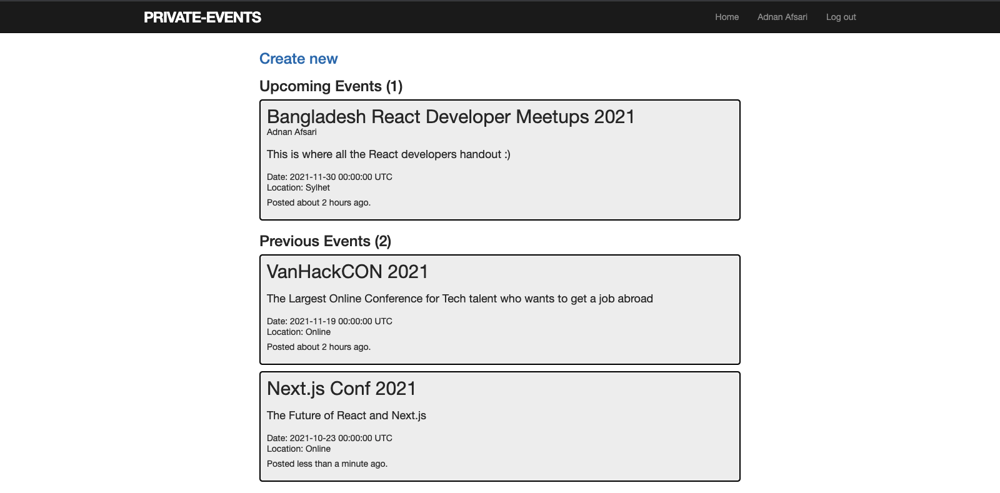

# Private Events

> An event listing application where users can post events and invite other users to the event.


Additional description about the project and its features.

## Built With

- Ruby
- Ruby on Rails
- Bootstrap

## Live Demo

[Live Demo Link](https://eventbit.herokuapp.com)


## Getting Started

To get a local copy up and running follow these simple example steps.

### Prerequisites
- Ruby: 2.5.5
- Rails: ~> 5.2.2', '>= 5.2.2.1'
- Postgres: >=9.5
- Git

### Usage

- Fork/Clone this project to your local machine
- Open folder in your local enviroment and run thes lines of code to get started:

Install gems with:

```Ruby
    bundle install
```

Setup database with:

```Ruby
   rails db:create
   rails db:migrate
```

Start server with:

```Ruby
    rails s
```

Then open a web page and go to [port 3000 on your local machine.](http://localhost:3000)


## Authors

👤 **Author1**

- GitHub: [@AdnanAfsari](https://github.com/AdnanAfsari)
- Twitter: [@AdnanAfsari](https://twitter.com/adnanafsari)
- LinkedIn: [LinkedIn](https://www.linkedin.com/in/adnanafsari)

👤 **Author2**

- GitHub: [@JamesOkunlade](https://github.com/JamesOkunlade)
- Twitter: [@JamesOkunlade](https://twitter.com/JamesOkunlade)
- LinkedIn: [LinkedIn](https://www.linkedin.com/in/james-okunlade)

## 🤝 Contributing

Contributions, issues, and feature requests are welcome!

Feel free to check the [issues page](../../issues/).

## Show your support

Give a ⭐️ if you like this project!

## Acknowledgments

- Hat tip to anyone whose code was used
- Inspiration
- etc

## 📝 License

This project is [MIT](./MIT.md) licensed.
